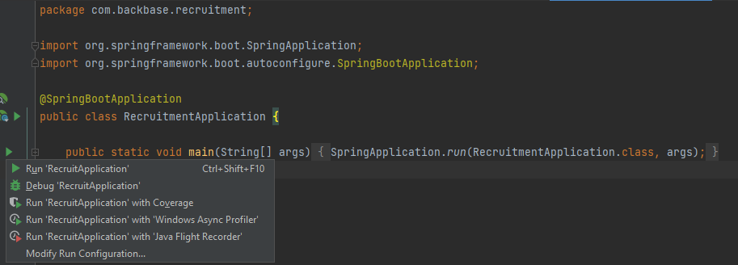

**How to run**

Application is an Intellij IDEA project so to run application you need this IDE.
All you have to do is to:

* go to class named RecruitmentApplication.java
* run main class

When you run it for the first time it will take some time. It needs read .csv file with awards data,
fetch proper movies from OMDb and populate database.

When it all happen you will see in application logs an entry:
"Movies are loaded to database"
