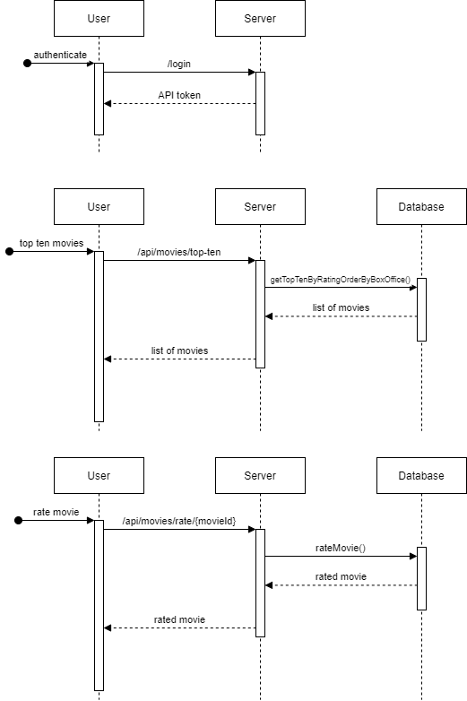

**How to test**

At first, you can run unit tests :

* Initially you can run unit tests, to do this use the command: `./mvnw test`
* You can also run unit tests using your IDE

To test the proper operation of an application, it is best to make HTTP requests.

* Run app
* To receive a token that allows you to query the API for movies, send a request to this address:`/login/?username=user&password=pass`. A token will be returned in response
* There are two more endpoints to check if the application works as intended. (Remember to add a Bearer token to your request header)
  * Rate the movie:`/api/movies/rate/{movieId}?rating={[1-10]}` e.g. `/api/movies/rate/5?rating=9`
  * Get 10 top-rated movies ordered by box office value: `/api/movies/top-ten`

The following are presented diagrams, that can help you understand how the application works:

* There is only one class named `Movie` (Class diagram)

* Next diagram presents how data flow between user and system (Data flow diagram)

* Three diagrams which shows communication in time between user and system (Sequence diagram)

